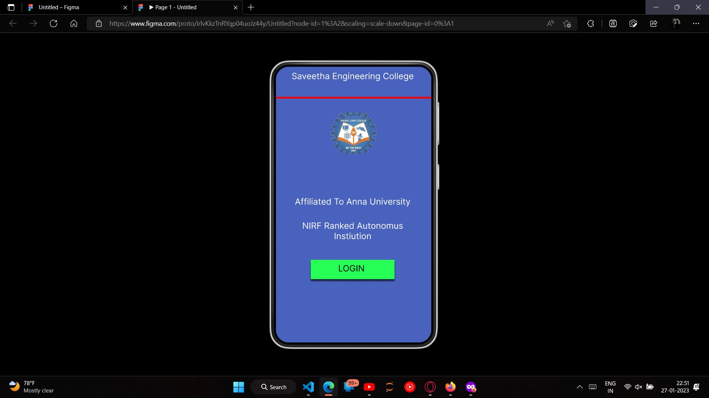
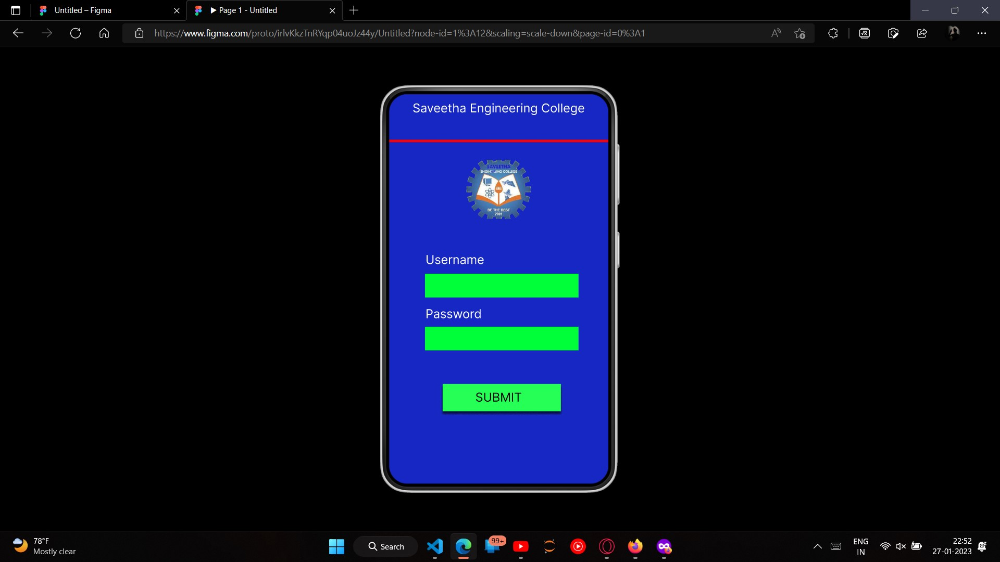
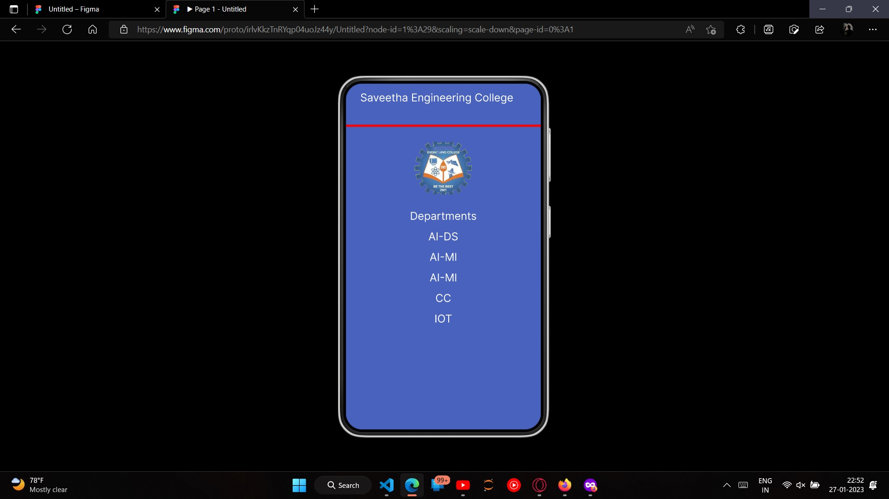

# Event Registration Web Application

## AIM:
To design, develop and deploy a web application for event registration.

## DESIGN STEPS:

### Step 1:
Create a new frame.


### Step 2:
Select any one preset size of your choice.


### Step 3:
Select the shapes you need.


### Step 4:
Import images as needed.


### Step 5:
Create pages based on your need and link them.


### Step 6:

Validate the HTML and CSS code.

### Step 6:

Publish the website in the given URL.

## DESIGN TOOL:
Figma

## PROGRAM :
```css
/* Home Page */
position: relative;
width: 360px;
height: 640px;

background: #4862BD;

/* Login Page */

position: relative;
width: 360px;
height: 640px;

background: rgba(28, 50, 250, 0.78);

/* Saveetha Engineering College */

position: absolute;
width: 336px;
height: 38px;
left: 0px;
top: 14px;

font-family: 'Inter';
font-style: normal;
font-weight: 400;
font-size: 20px;
line-height: 24px;
text-align: center;

color: #FFFFFF;

/* Departments */

position: absolute;
width: 336px;
height: 38px;
left: 12px;
top: 233px;

font-family: 'Inter';
font-style: normal;
font-weight: 400;
font-size: 20px;
line-height: 24px;
text-align: center;

color: #FFFFFF;

/* AI-DS */

position: absolute;
width: 336px;
height: 38px;
left: 12px;
top: 271px;

font-family: 'Inter';
font-style: normal;
font-weight: 400;
font-size: 20px;
line-height: 24px;
text-align: center;

color: #FFFFFF;

/* AI-Ml */

position: absolute;
width: 336px;
height: 38px;
left: 12px;
top: 309px;

font-family: 'Inter';
font-style: normal;
font-weight: 400;
font-size: 20px;
line-height: 24px;
text-align: center;

color: #FFFFFF;

/* AI-Ml */

position: absolute;
width: 336px;
height: 38px;
left: 12px;
top: 347px;

font-family: 'Inter';
font-style: normal;
font-weight: 400;
font-size: 20px;
line-height: 24px;
text-align: center;

color: #FFFFFF;

/* CC */

position: absolute;
width: 336px;
height: 38px;
left: 12px;
top: 385px;

font-family: 'Inter';
font-style: normal;
font-weight: 400;
font-size: 20px;
line-height: 24px;
text-align: center;

color: #FFFFFF;

/* IOT */

position: absolute;
width: 336px;
height: 38px;
left: 12px;
top: 423px;

font-family: 'Inter';
font-style: normal;
font-weight: 400;
font-size: 20px;
line-height: 24px;
text-align: center;

color: #FFFFFF;

/* Line 3 */

position: absolute;
width: 360px;
height: 0px;
left: 0px;
top: 80px;

border: 4px solid #FF0000;

/* download-removebg-preview 3 */

position: absolute;
width: 106px;
height: 97px;
left: 127px;
top: 108px;

background: url(download-removebg-preview.png);
```


## OUTPUT:





## Result:
The program to design, develop and deploy a web application for event registration is completed successfully.


